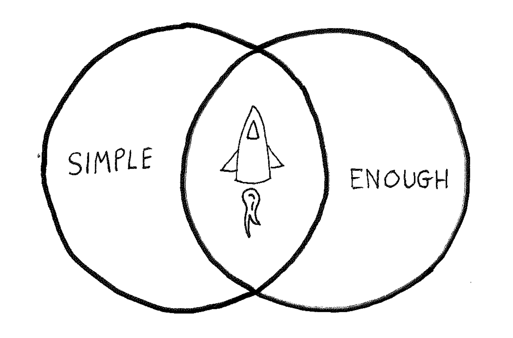

[Adam](https://www.linkedin.com/in/adam-curl-23a2911b3/) and I were meeting about a sketch we made for the software we were building.

We posed the [Essential Release](/glossary#essential-release) question, "In this sketch, what is not required for this view to work?"

