At [Sodium Halogen](https://sodiumhalogen.com?ref=chancesmithio) (SH), we're digging into a data-rich project. The task at hand is to have a javascript timeline that has several features we're trying to fit in.

The options we have are to find something that matches closely or build our own. Today I'm digging through the internet to find the right solution.

To protect our SH customer, some of the details are vague. That, I do apologize for.

## small scale mocks of the timeline idea

Gantt chart like with mini timeline map at the bottom
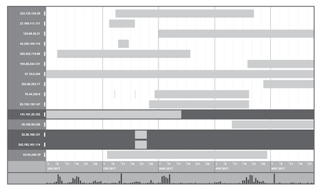

Inner elements inside a gantt chart bar
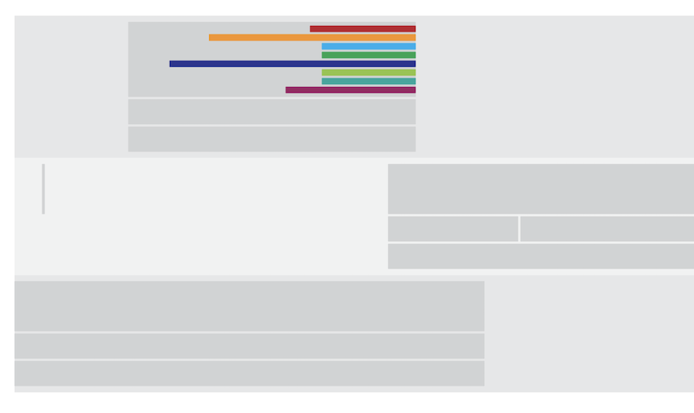

### features needed

- gantt bars are time intervals
- gantt bars are dots or moments in time
- box drawing selection
- scrollable (horz/vert/zoom)
- grouping of gantt chart bars
- inner-nest items in a gantt chart bar

Let the digging for solutions begin...

## Diving into the internet looking for a javascript timeline graph or framework

I know [D3](https://d3js.org/) will show up along the way. I have run across D3 a lot looking for graph solutions. The D3 framework seems to be a mind-job to get started, but holds a lot of promise. We'll see...

## D3.js Gantt Chart, example 3

---

This solution looks like a good start for a custom timeline graph. Not a bad place to begin the search. 💪

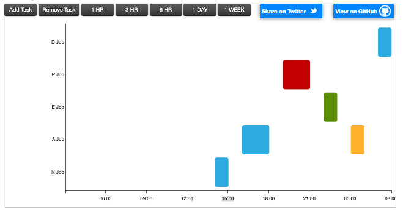
http://bl.ocks.org/dk8996/5538271

### example D3.js pros

- shows intervals
- best fit for starter D3 custom build
- timeline changes as expanding time

### example D3.js cons

- not scrollable (horz/vert)

Let's keep looking...(see another D3 example further down)

## Overwhelmed with frameworks starting now

---

Wikipedia then shows up with a plate full of options.

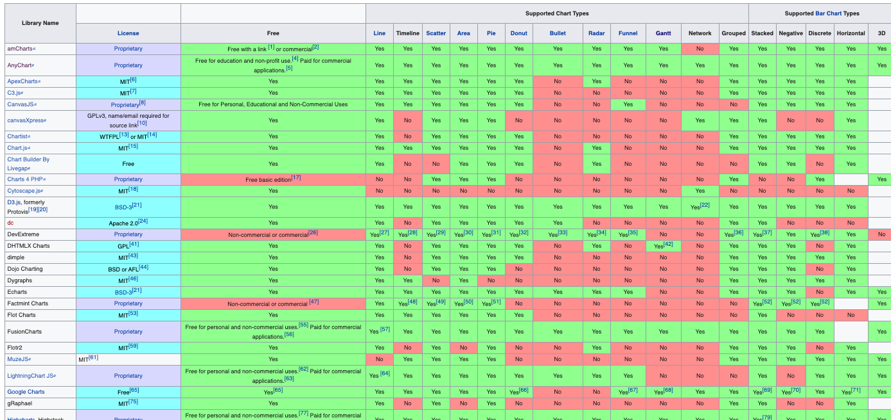
https://en.wikipedia.org/wiki/Comparison_of_JavaScript_charting_libraries

## amCharts - Timeline and Gantt charts

---

amCharts has been in the running for this solution before. The visuals and animations are amazing!

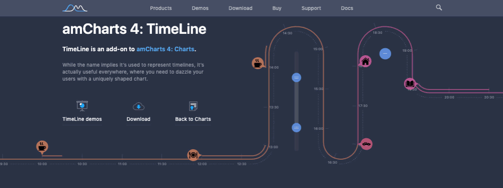

I currently feel the graphs I see in the [new amChart4 timelines](https://www.amcharts.com/timeline-chart/) aren't a great fit for analysis, but great tools for telling a story with the data that is found.

There has been some hope we could use the Gantt chart.

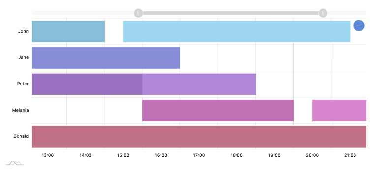

### amCharts pros

- the timeline shows a range of data with the top handle UI

### amCharts cons

- not scrollable (horz/vert/zoom)
- inner content would need to be dropdowns instead

This is really close to want we want, but might be painful to bend-to-our-will.

## AnyChart - Gantt chart

---

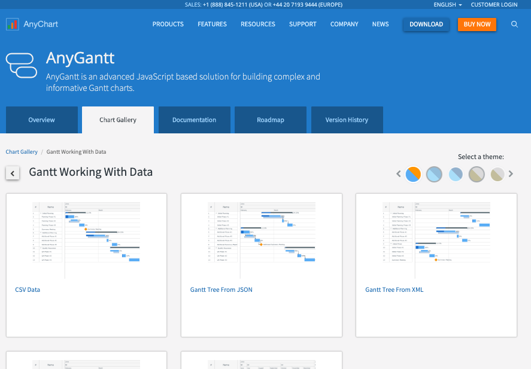
https://www.anychart.com/products/anygantt/gallery/Gantt_Working_With_Data/

### AnyChart pros

- hierarchy of gantt bar elements (expandable with clicks)

### AnyChart cons

- not scrollable (horz/vert/zoom)

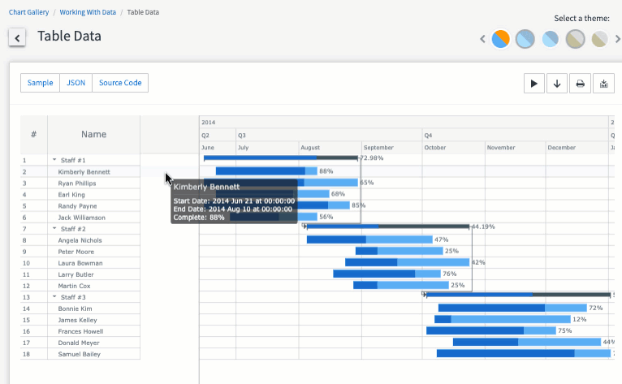

## Vis.js - Timeline chart

---

An outdated branding, but super feature-rich. This one has so many examples and use-cases.

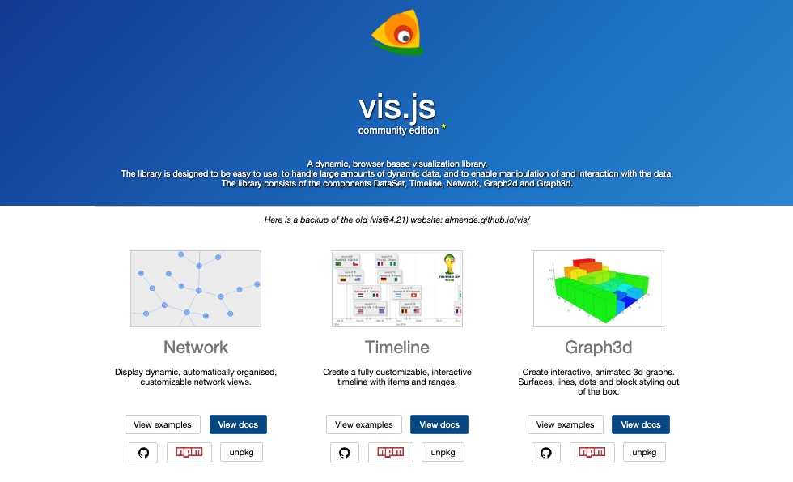
https://visjs.org/

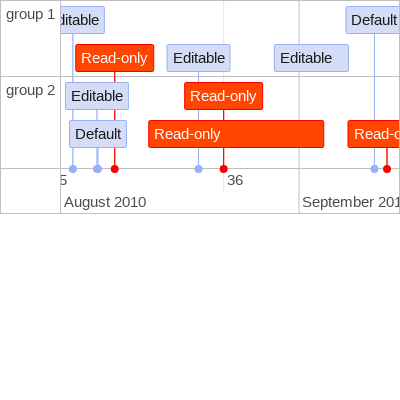
https://visjs.github.io/vis-timeline/examples/timeline/groups/groups.html

### Vis.js pros

- so many options to tinker with
- scrollable (zoom) & click+drag for panning left/right
- grouping of gantt chart bars

### Vis.js cons

- not sure how to handle box drawing selection

Very promising as well.

## Chart.js simple and flexible charts

---

These are simple and pretty. Yet, don't seem to have a good gantt or timeline chart we can use.

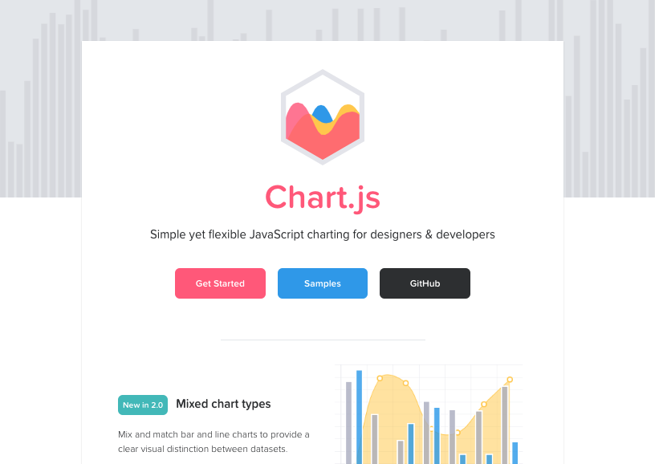
https://www.chartjs.org/

Not a good fit for us.

## D3.js scrollable timeline example

---

The x-axis timeline scales well on scroll. Nice.

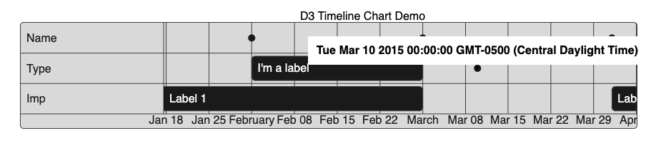
https://www.cssscript.com/demo/simple-scrollable-timeline-chart-with-d3-js-d3-timeline/

### D3.js scrollable timeline pros

- dots for moments in time
- scrollable/pannable, nice

### D3.js scrollable timeline cons

- not sure how adding more rows will stack
- eh, definitely not as pretty as some of the previous (not a deal-breaker)

Details: https://www.cssscript.com/simple-scrollable-timeline-chart-with-d3-js-d3-timeline/

## vasturiano: timelines-chart

---

This is nice as well. The zoom feature is handy but might conflict with the way we want to handle the node selection.

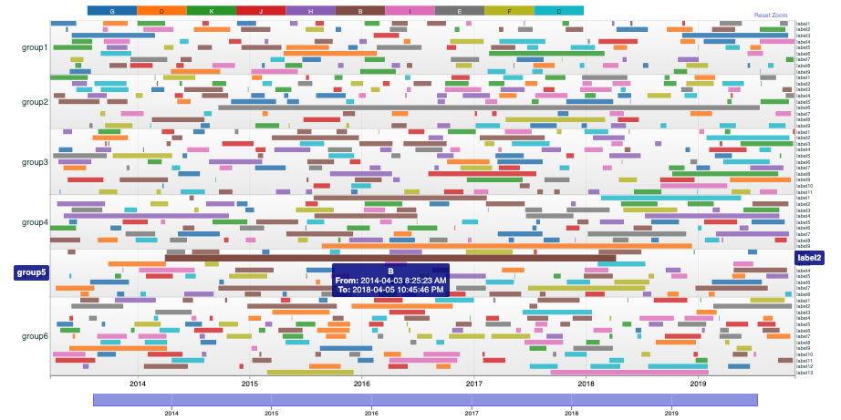
https://github.com/vasturiano/timelines-chart

Also, a StackOverflow request that this tool is mentioned as the solution: https://stackoverflow.com/questions/48890790/d3-multi-layer-timeline

### vasturiano pros

- zoom by selection
- bottom vert-pan bar

### vasturiano cons

- not scrollable

## jiahuang: d3-timeline

---

Kind of a dated repo, but has quite a few examples to be inspired by.

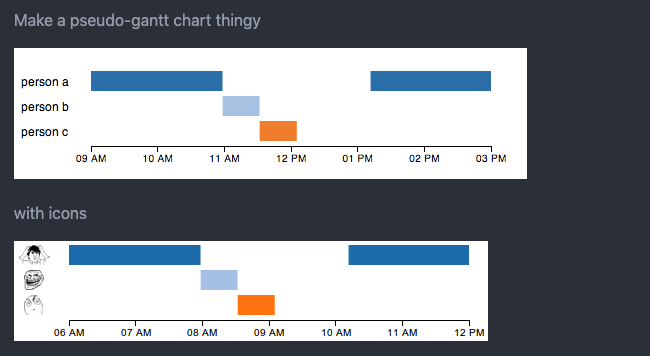
https://github.com/jiahuang/d3-timeline

shows a StackOverflow request: https://stackoverflow.com/questions/13201749/draw-simple-timeline-with-d3

If we do a D3 build, this is another inspiring example.

## bill's d3 timeline

---

Another good D3 example for inspo.

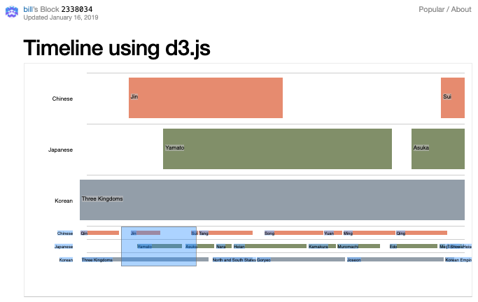
http://bl.ocks.org/bunkat/2338034

The more D3 examples I find, the more comfortable I am to building something from scratch using the D3 framework. 🤔

## Reinhard Engel's timeline concept

---

Yet, another D3 example with may rows in the timeline. Cool!

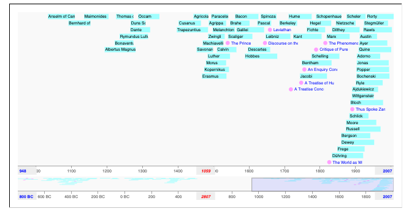
http://bl.ocks.org/rengel-de/5603464

## Timeline research exhausted

---

With these in mind, I believe we can now pump out a few sandboxes. We'll probably start with vasturiano's timeline-chart and look further into how we can add the features we need.

Got questions? Hit me!
