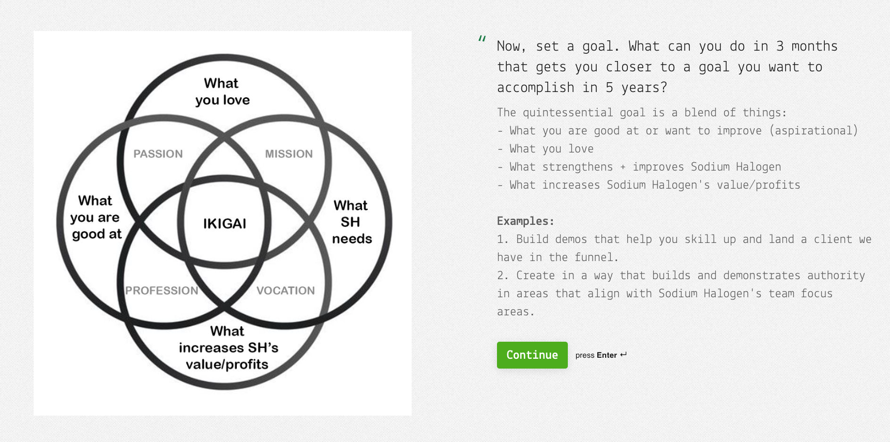

For almost 4 years now, we've done quarterly checkups with our team. Every 3 months, we'll meet with one team member and see how they're doing and ask how we can help them.

## Goal Setting for the Team

Yet, one area we've needed help with is helping them set goals for themselves. We've pushed them to think 5 years out about where they want to be. [Like Google does](https://www.inc.com/bill-murphy-jr/google-says-it-still-uses-20-percent-rule-you-should-totally-copy-it.html#:~:text=Google%20itself%20says%20yes.%20A%20Google%20spokesperson%20told%20me%20this%20week%20that%20%2220%2Dpercent%20time%22%20is%20%22a%20long%2Dstanding%20Google%20initiative...and%20still%20an%20active%20program.%22), the 3 Month Goal is aimed to be worked on during ~20% of their at-work time. If the goal can be centered around how it helps them, the team, AND the company, it's a win-win-win. Think IKIGAI. Here is an image of our checkup form asking the team member to pick a 3-month goal that aligns with their's and SH's wants and needs.

## New Goal Setting Idea

Here is what we came up with today. We'll see how it goes.

**3 Month Goal**: What if you set a goal of X number of sandboxes created over the following x weeks (until the next checkup) covering a mix of X, Y, and Z areas in which you want to practice (i.e., backend, full-stack, TDD, a11y, react-native)?

**Example**: So I can get reps in areas that help me and SH...by April 10th, I'll have completed 4 tiny sandboxes related to upcoming features we need in SH projects. I'll complete one every 2-3 weeks and share it with the team during Beer30 or Loom.

This approach will make setting trackable goals easier and less intimidating.
