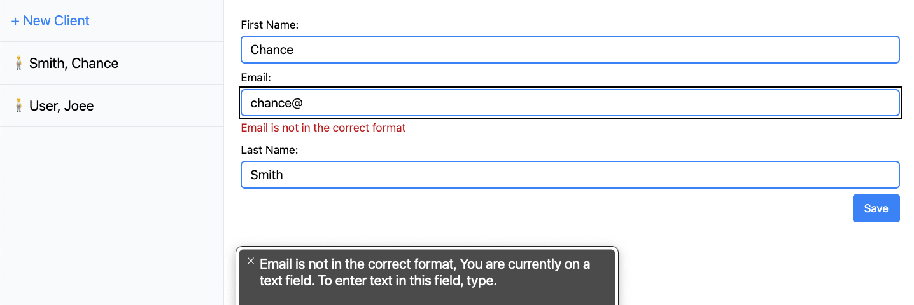
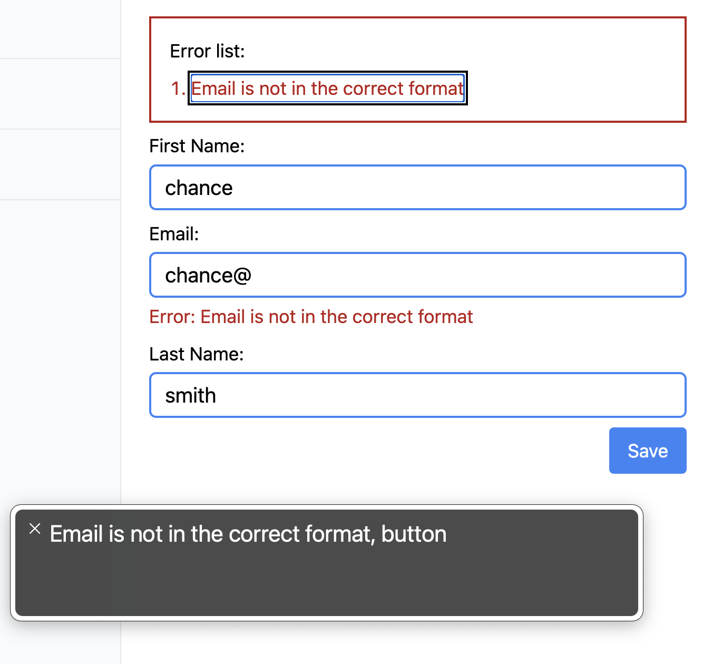

This post is a work in progress.
Last updated: 5/11/2023 - added WAVE link

I'm starting a new project helping the visually impaired use software. There are many resources; I need this to be a digital garden of sorts to organize an approach and research around the topic. I hope this is helpful and that you enjoy it. Bear with me, as this needs to be organized and curated in its current state.

## Resource links

- https://www.a11yproject.com/checklist
- http://inclusive-components.design
- https://a11ysupport.io/
- [personas with access needs](https://alphagov.github.io/accessibility-personas/)
- [accessiblity kit](https://www.voorhoede.nl/nl/blog/accessibility-kit-for-web-developers/)
- [measure the accesibility of your site](https://accessibe.com/accessscan)
- [frontend accessiblity training with FrontendMasters](https://frontendmasters.com/courses/?q=accessibility)
- [nocoffee firefox addon](https://addons.mozilla.org/en-US/firefox/addon/nocoffee/)
- [A11y Style Guide](https://a11y-style-guide.com/style-guide/)
- [WAVE - Web Accessibility Evaluation Tool](https://wave.webaim.org/)

## Questions

### How are form errors handled best?

At first, I thought errors would be auto-focused. The user would be taken to the first field with a mistake, and the error would be read to them.

Demo #1

Yet, after finding the A11y Project checklist, it's recommended to put the list of errors at the top of the form.

Demo #2

Is auto-focusing on the field or the error list still disorienting for those with no sight? This was listed on the checklist as well.

The next step will be to use your test in these two demos and get feedback about the best approach.

### Are in-app keyboard shortcuts better for navigating?

If there are app-specific keyboard shortcuts, users shared that exiting the [JAWS Virtual PC Cursor](https://support.freedomscientific.com/teachers/lessons/4.2.3_VirtualPCCursor.htm) is annoying.

I'll start with VoiceOver and see if the in-app keyboard shortcuts are available while VoiceOver is on.

...need to test this.

### Is it best to prevent horizontal scrolling and keep all content vertical like a mobile experience?

While watching users move around their screens, the user spends too much time horizontal + vertical scrolling. Removing the horizontal axis will reduce the hide-and-seek experience.

### What is the best way to hide input labels but still have them read by screen readers?

The A11y Project offers up solutions for hiding content for screen readers or for visual users.

https://www.a11yproject.com/posts/how-to-hide-content/

## My empthy dialed up

Apple does a great job bringing attention to how they've solved the accessibility challenge. ([🎥 The Greatest](https://www.youtube.com/watch?v=8sX9IEHWRJ8))
