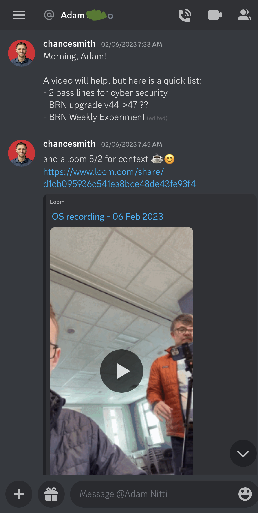

When you’re stuck, screencast the issue you’re having and send it to someone.

Screencasts allow for asynchronous meetings and help you move on to the next task while you wait.

## Asynchronous meeting in action

Here I sent a list next tasks to a colleague in our Discord chat. The link to the Loom video is an asynchronous meeting. A [5on2 meeting](https://www.sodiumhalogen.com/glossary#5on2).

Another example is asking a question on Reddit or StackOverflow. Once you’ve posted your question on the inter-webs, you can start a new task while you wait for an answer.

Asynchronous meetings are still a form of batching up your questions, so you’re asking all your questions at one time that is convenient for your team.

## Attend when ready

Joining an asynchronous meeting means I can attend when it’s convenient. Even the pace is convenient (2.5-3.5x speed).

## Everyone can join asynchronously

Even having a 1-on-1 meeting first can be a good default. Regardless of who attends, record the meeting. Everyone else that wants to get looped can attend asynchronously.

An added benefit is you can reference any details from the calls later.
