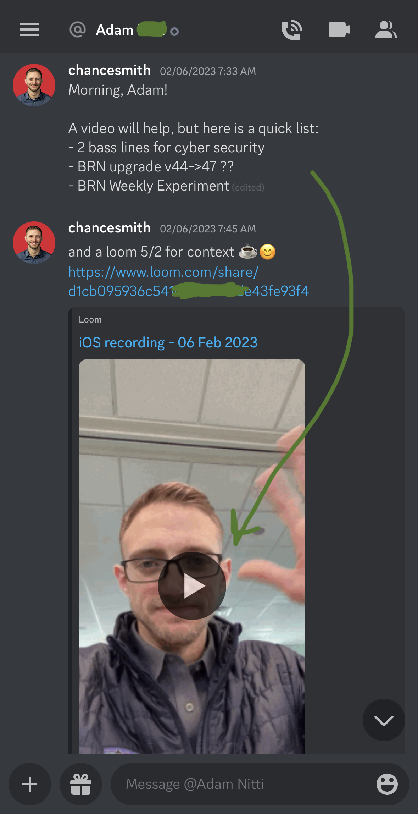

When you’re stuck, screencast the issue you’re having and send it to someone.

Screencasts allow for asynchronous meetings and help you move on to the next task while you wait.

## Asynchronous meeting in action
Here I sent a list of tasks to a colleague in our Discord chat and a Loom conducting a 5on2 meeting asynchronously.

Another example is asking a question on Reddit or StackOverflow. Wherever you post your question, once you’ve posted your question, you can start a new task while you wait for an answer.

Asynchronous meetings are still a form of batching up your questions, so you’re asking all your questions at one time that is convenient for your team.

## Attend when ready
Joining an asynchronous meeting means I can attend/consume when it’s convenient and consume at a convenient pace (2.5-3.5x speed).

## Everyone can join asynchronously
Even having a 1on1 meet first can be a good default. Regardless of who attends, just record the meeting. Everyone else that wants to get looped can attend asynchronously.

An added benefit is you can reference any details from the calls later.