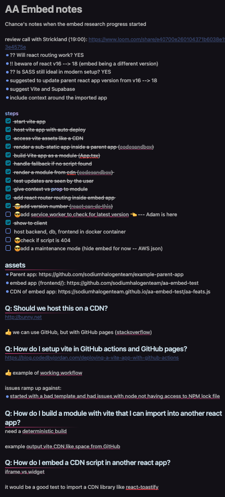

## Who should read this?

1. You are constantly solving new problems. The problems may not be new to the world, but they are new to you or your team.

2. You see value in documenting your way through your roadblocks and solutions.

3. You get distracted or come back later, not remembering what you have tried and where you left off.

4. You would like a place to store and share solutions. And want some tips to improve.

5. You're working on a task that others will need to pick up where you left off or repeat in the future.

> TL;DR: Document as you go with the questions you ask, sources you find, rules to follow, and solutions you arrive at.

## Why document the problem?

We get stuck on problems we're solving. Especially if we're doing something new.

At [Sodium Halogen](https://sodiumhalogen.com?ref=csio), we often discuss the ideal times to ask each other questions. We all use [the 5on2 method](/glossary#5on2), but what if we reach a roadblock? Or we're working in new territory?

If a team member has been stuck on an issue and asks for help, I ask myself, "What step are they on in their process? How long have they been stuck?" and, "What have they tried along the way? What did they search for?"

## How to document the problem?

This isn't a difficult process to follow. Just create the habit of documenting as you go.

### 1. Type out your plan ✅

Make a list of to-dos you believe will get to a milestone or point of completion and where someone can review your work. Mark off each item as you complete it.

### 2. List your questions ❓

As you work, list out the questions and search terms you use. This will help you remember what you've tried and where you left off. As soon a questions comes to mind, write it down. You can come back to it later and answer them as you go.

Also, Reorder your questions as they line up with your to-dos. Putting your questions in order of priority will help you create a timeline of your work. You'll also know where you left off.

### 3. Research your questions 🧐

Answer your questions. Use Google and GPT to ask questions and note what you found from what source.

### 4. Document what works 💡 and what doesn't ❌

Make note of what you learned, what is working, and what isn't.

### 5. Improve the notes for sharing 📝

Review the note and make it more readable for others. Your notes and links will be helpful, but you'll want to make it easy for others to follow.

## What does documenting the problem look like?

In Obsidian, I documented the proccess of adding an embeded React app to a parent React app. I documented the steps I took, the questions I asked, and the solutions I found. I also documented the steps I took to share the solution with others. (screenshot below)



Here's a [repo template](https://github.com/chancesmith/document-the-problem-template), and a example below.

```markdown
# Adding X feature to Y app

## To-dos

- [x] add new endpoint to get data
- [ ] add query to get data
- [ ] call query in new page
- [ ] allow user to set a peference of sorting
- [ ] store user preference in localstorage

## Progress/Questions

### What is the common endpoint URL structure?

[LINK-TO-ENDPOINT-DOCS-HERE](https://domain.com/docs)

💡 An existing endpoint is at `/api/v1/account`. The new endpoint will be at `/api/v1/new-feature`.

## When do I bump the version on the endpoint?

### Where do queries live in the frontend?

### Where do other experts put their frontend queries?

### What alternatives are there to localstorage for this project?
```

**Quick tips:**

- mark off to-dos as you complete them
- add links to resources you find
- mark solutions with a lightbulb 💡
- mark questions that are answered with a checkmark ✅ (remove if need to find another solution)
- take notes as you go and make this process your own

## Benefits of documenting the problem

- You'll have reocrded your work that others can find and follow.
- Because you can see the progress, you'll have more confidence in what you have accomplished.
- Becuase your questions our out of your head and on to paper, others can help answer your questions when you meet with them.
- You can come back where you left off.
- You'll only have to solve this problem once.

## The point is

If you document as you go, you can come back to it later.

You can share it with others.

You can improve it.

You can learn from it.
