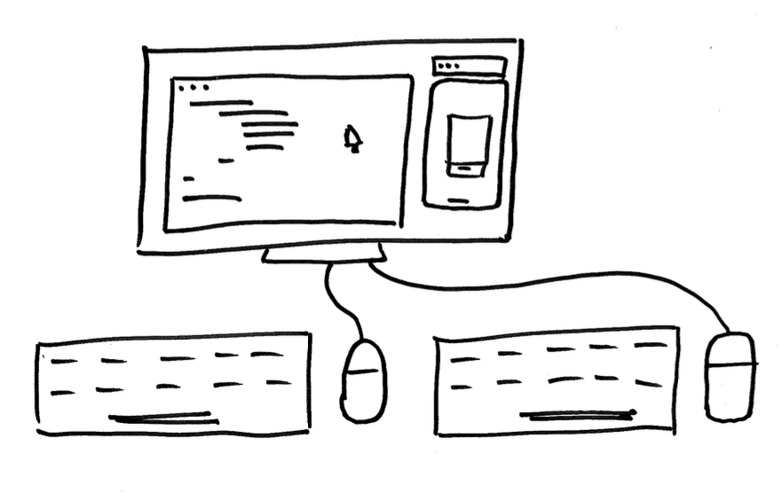

There have been many I've met with that were concerned with pair programming. One senior developer said:

I feel my IQ drops 20 points when I pair.
Yeah, some come to pairing feeling pressure or mentally clouded. Others can have opposing personalities.

## How can we adapt?

1. **Ask questions**: Dial up the collaboration and leave room for both to think and speak by asking questions. "What if we...?" or "How might we...?"
2. **Trade on a rhythm**: Make sure none hogs the keyboard. Trade on a failing test or set a 25-minute timer to trade the driver's seat.
3. **Give commentary on the work**: Don't lose your partner. Keep them updated on what you're thinking. This out-load thinking will help them think more like you in the future and pick up where you left off.

You will get comfortable over time. Just like learning a new skill, starting a new job, or working from home for the first time, **you'll need time to adjust**.

The real benefit to pairing, I believe to be the most valuable skill you can have in any field, is duplicating yourself. The sharing of information between the two of you is powerful.

Your innovation advocate, Chance 👋