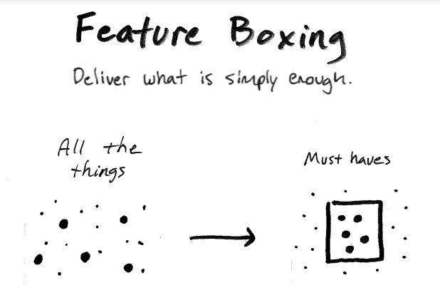

A challenge in creating software, really any business, the work doesn't go as planned. With the current constraints, we're balancing two things; all we can imagine and the feasibility of completing the work.

It's easy for our team to get caught up in the non-essential, nice-to-haves, or over-engineered solutions for the future.

How might we focus on real business impact? Feature Boxing is a way you can keep your team focused on delivering valuable software on budget.

## Feature Boxing

> Deliver what is simply enough.

(kinda like these sketches 😜)

Tackle the must-haves first and deliver earlier.

With an early release in a third or half the budget, now you can decide on the most impactful nice-to-haves with the budget you have left.

No matter what work you do, you can feature-box to take action and stay focused on the important.

Your innovation advocate, Chance 👋