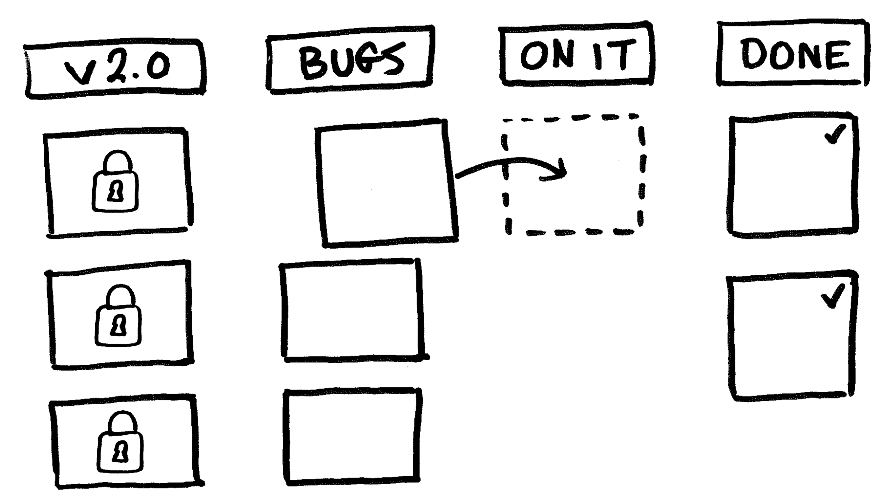
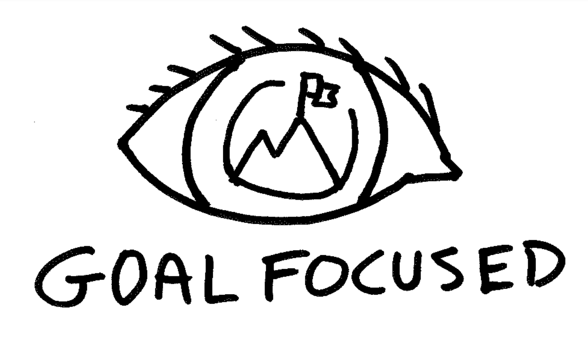
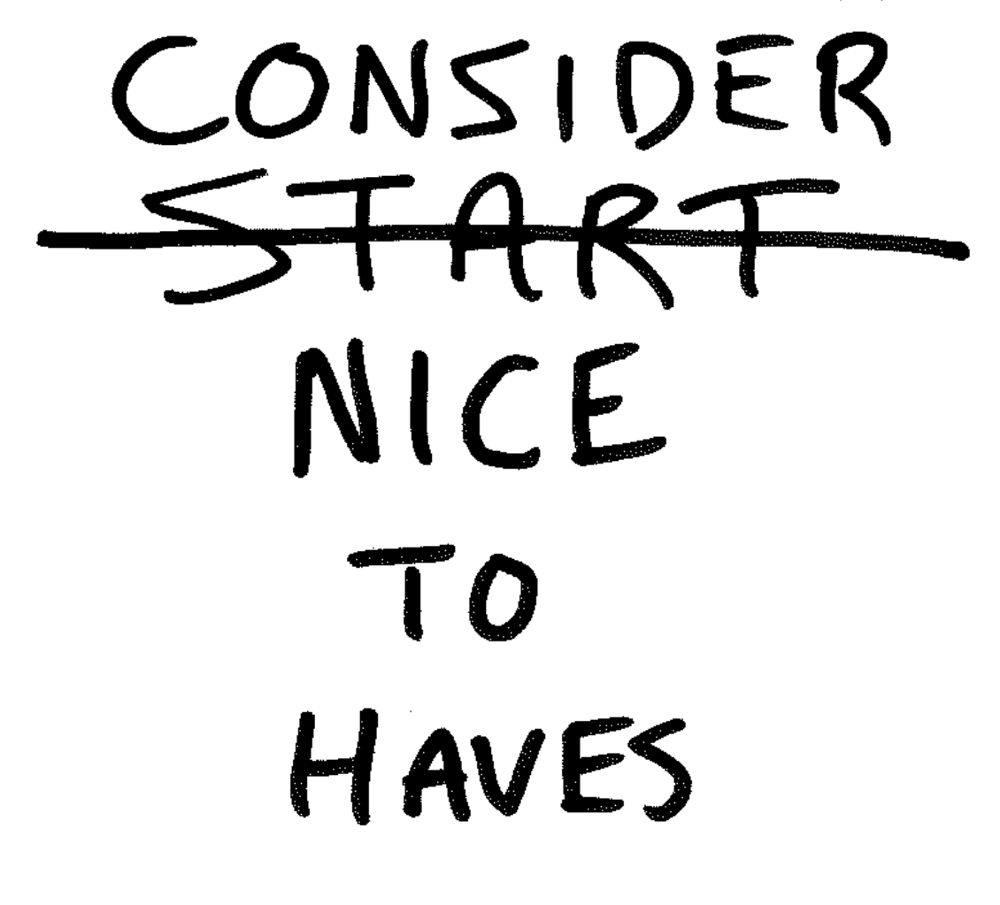

After a few months of consistent releases, your team crosses the finish line and finally launches the product. 🍾🙌 Glorious! Great job, everyone. Stellar work!

You've now reached a point where a decision is made. Don't delay this conversation any further.

> "Yo, team! If we keep making changes to our app, what changes should we make, and when should we start?"

Let's begin to answer these two questions.

## How to give your team permission to focus on high-impact work

Remind the team of your long-term goals. With your vision in mind, decide if the work in front of you will deliver true progress.

**Will today's work assist in reaching your goal?**

> "Let your eyes look directly forward, and your gaze be straight before you." - Proverbs 4:25

You and your team must **be ongoing advocates for your cast vision**. Don't allow the urgent and unimportant to get in the way of what you prize most. They're distractions. Stop!

How many distractions do your team members have? The number isn't important, just [set boundaries and get closer to zero](https://chancesmith.io/focus-get-closer-to-zero/).

> "A man without self-control is like a city broken into and left without walls." - Proverbs 28:28

At the very least, you can decide to pause the project and push your team's attention to something else.

## Save your team from nice-to-have v2 or v(N) features

Your sprint backlog is a never-ending to-do list of promising features. Teams feel like there is no end in sight. They don't know where the proverbial *project bookends* show be. So, it's vital to set constraints. Let's walk-through through how to get your team and software on track. Here are the **4 steps after each version launch**.

## 1. Celebrate the progress made

Don't gloss over the hard work your team has done. The hope is that their inputs and early deliverables will bring an early desirable outcome.

## 2. Set success metrics before starting on new features

This is time to let the software work and measure success. Also, you're giving your team permission to focus. Pick success metrics that determine the project is worth more investment and that help decide what features should be next. Be sure you can track these in the software. Here are a few ideas to start with.

- X number of users per week
- X churn of subscriptions or daily/weekly visits
- user activity that produces X revenue (or desired outcome) per month
- X number of support tickets and success
- X app store reviews and ratings per week

Be sure your metrics are drivers of value over time.

Encase your success metrics don't hit, set a time limit to trigger a moment to make the decision. Maybe 2-weeks or 3-months can confirm if more progress should be made.

To note, during this time, it's great to have marketing continue promoting the app but add constraints as needed.

## 3. Schedule what's in your next release

At this point, you have reached your success metrics or you decided to forge on. Now, you pick the work that is important and impactful for the next product release.

This is where our team will lock down our capacity by stacking up 4 weeks or more. We'll continue sprinting weekly until we reach the bottom of our backlog.

## 4. Crush the bugs - for just awhile

Our team sets a 3-month time limit for bugs to surface after we launch. If any bugs arise, we'll tackle them while waiting for the success metrics to hit.

## Define the bug scope 🔬
Before we wrap up, so there is a standard and boundary to what the team can work on, let's define a bug. As new bugs hit your kanban inbox (LINK), your team can call an audible for what should be labeled a bug or not.

### What is a software bug? 🐛

- unexpected behavior (ex: link to wrong view, expected an input error, glitch, role access)
- errors or exceptions thrown (ex: 404, authentication failure)
- style tweaks (ex: UX issues, correct spelling)

### What is NOT a bug? 🙅‍♀️
These are good examples of what should be included in a new release.

- content changes
- UX flow changes
- new features, views, or modals
- changes to modify the current features and experiences

## Conclusion

Thanks for reading. It's great to put my learnings into posts and workshops so you can learn to do it too. If you're interested in improving the pace and collaboration of your team, [schedule a coaching call or sign up for a workshop](https://chancesmith.io/coaching).

And don't forget, if you haven't read the "[Get Closer to Zero](https://chancesmith.io/focus-get-closer-to-zero/)" post, please give it a read.

Your innovation advocate, Chance 👋