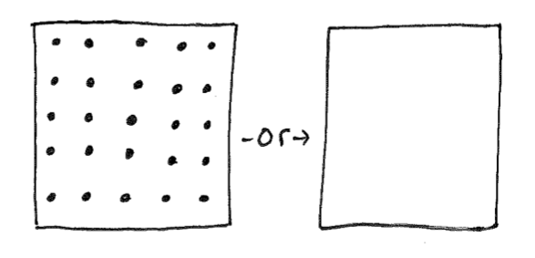

Our two oldest boys and I are cleaning their room. Our oldest seems frustrated at the mess we are cleaning, and I turn to ask some questions.

Me - "One room has one-hundred items, and another has zero. What room would you rather clean?"
Son - "zero, sure!"
Me - "Yeah, let's get closer to zero."

Zero is not the goal, but a space occupied by less needs less cleaning.

Also, the kids will typically play in their room when it's clean.
