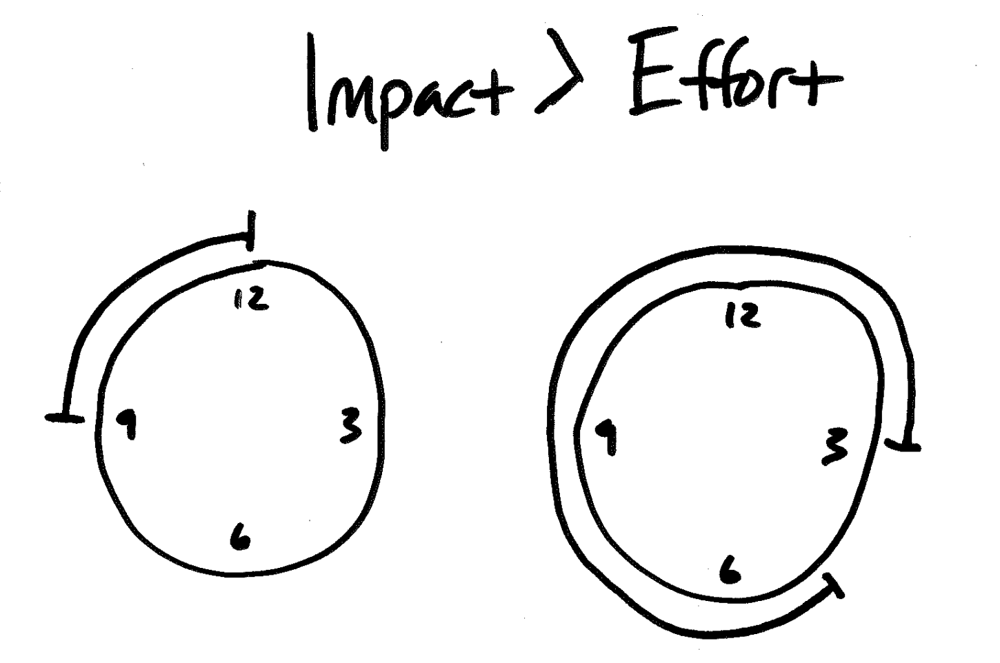

Starting this year, we opened up profit sharing with our team. The profit pool pays out team members roughly 9-12% of each person's salary.

## Why did we start a team profit share?

We want our team to be closely connected to the bottom line and be measured the same way our clients measure us, by our impact, not our effort.

Now that time tracking is aside, our team and clients are incentivized to do the important and impactful first, over just doing the next task.

## What is the difference between effort and impact?

How is effort tracked?

- time spent
- widgets delivered ??
- features to production
- brute force
- juggling many things

How is impact measured?

- more project
- less team/client turnover
- better team culture
- expertise gained
- better quality of life (sleep, happiness, stress)
- lessons learned
- fewer distractions

(fewer distractions)

## Stop measuring effort

We don't want our customers judging our work based on the amount of time we spend but instead looking at the value.

We could sell customers time, giving options like sprint weeks, four more hours, or one-year contracts. Yes, selling our time would help us measure our capacity better, but growing our team to sell more-and-more hours isn't leading to high-impact or expertise work.

When we measure effort, we are discouraged to:

- buy the best tools
- hire the best talent
- seek efficiencies
- research best practices
- spend time teaching others

Tracking time yields little risk and little reward. When we prioritize tracking time, we're financially penalized for doing what is best for our team and client.

> "Hourly billing for professional services is a horrible practice for everyone involved. It devalues the expertise of the consultant and encourages mistrust in the client because the financial incentives of the two parties are misaligned." - [Jonathan Stark](https://jonathanstark.com/hbin)

## How can we drive impact?

Stop measuring effort. Measure impact.

Be more brains 🧠 and less hands ✋🤚 to our clients.

Increase exposure to high-impact problems that need to be solved.

Build expertise so we can sharp-shoot on problems we've solved before.

This is a practice we have at [Sodium Halogen](https://sodiumhalogen.com?ref=csio).