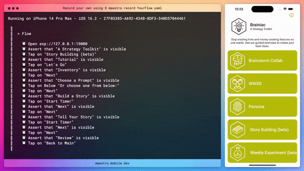

TL;DR: Maestro is a tool for testing native apps. You simply write tests in a YAML file

## Native app testing is challenging

After many attempts of testing with [Cavy](https://cavy.app/) and Detox. I had basicly given up on E2E testing, specificly for our React Native projects.

I did have success last year with [Detox](https://wix.github.io/Detox/) and mocking the API with [MirageJS](https://miragejs.com/) (mock server). But it was a lot of work to setup and I don't have a lot of experience adding tests to the project. So I was looking for something that was easier to setup and use.

I will say, these tools have had time improve and I should definitely give them another try sometime.

## Maestro is awesome

Then I found [Maestro](https://maestro.mobile.dev), a tool for testing native apps. You simply write tests in a YAML file. It's similar to [Cucumber](https://cucumber.io/docs/guides/overview/), but for native apps.

This is the first flow I made today.



The YAML look like this:

```yaml
appId: host.exp.Exponent
---
# needed to open app in expo
- openLink: exp://127.0.0.1:19000
- assertVisible: "A Strategy Toolkit"
- tapOn: "Story Building (beta)"

- assertVisible: "Tutorial"
- tapOn: "Let's Go"
```

It's very easy to write and understand. I can see this being a great tool us to continue use.

## Current questions I have

I need to go through the docs more, but here are some questions I have.

- How do I copy the value of the text in a button?
- How do I check the value inside of the input field to compare with what I've copied?
- Is it best practice to have one test file that runs all single flow files?
