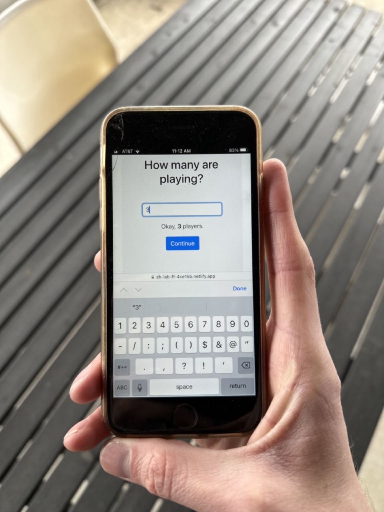

I value it when we have big problems to solve or when we are slow at work. These times allow us to burden a heavier load than we're used to and sharpen our saw. They're why I enjoy hackathons so much. These moments are great for prototyping, learning, and exploring.

So, here is our Rapid Prototyping Framework.

## Who should read this?

Continue reading if you have a big problem to solve, want to reduce the risk, and want a safe area to practice, a place you can't fail.

Continue reading if you are new to prototyping or want to improve your prototyping process.

## We prototyped a game

Many years ago, we were approached to build [The FunFact Game](https://apps.apple.com/us/app/fun-fact-best-party-game-app/id1525612753), a fun digital game to break the ice among small in-person parties. There were many challenges we would have to overcome; commerce, game rules, virality, and user engagement, to name a few. We were excited and needed tools and exercises to solve these problems faster. We first reached for Rapid Prototyping. Let's break it down.

**Prototyping** – a sample & design of a new product built to evaluate a concept or procedure. Some

**Rapid** - Happening in a short time or fast pace.

**Rapid Prototyping** - Prototyping in a Lean Startup fashion; Build, Measure, Learn. Be willing to start over or burn it to the ground.

If you're going to move fast and learn, you need to be willing to fail. Like Facebook's motto, "Move fast and break things."

In the Google Venture’s Design Sprint framework, you ideate, prototype, and user test all in just 5 days. When talking about the Design Sprint book, Eric Reis say you need a [prototype mindset](https://www.linkedin.com/pulse/prototype-mindset-eric-ries/).

> "Instead of taking weeks, months, or, heck, even years building some solution, you’re going to fake it. In one day, you’ll make a prototype that appears real, just like that Old West façade. And on the next day, your customers — like a movie audience — will forget their surroundings and just react."

Are you ready to build fast and learn quick?

Here are three steps to help you be successful in your prototyping. Let's get to it.

## 1. Define the challenges

Start by listing the problems that could benefit from a prototype.

1. Break out the sticky notes and list your riskiest assumptions, unknowns, or user frustrations. You might have a mix of these, and that's fine.

2. Put these onto a 2x2 (Eisenhower matrix) of High-Impact and Low Effort.

3. Then pick three high-impact challenges from the matrix you want to prototype.

## 2. Set Constraints

So we can move quickly, let's set boundaries of time and materials upfront. Decide what you will and will not use. 

When building software, you can consider aggressive time frames (2 hours, 2 days, 1 week), and your materials can be a mix of the following. We suggest you picking more than one.

- no database
- raw materials (paper and pen)
- design tool only (i.e., Figma)
- no frontend (i.e., endpoints, logs, CLI)
- no backend (i.e., mock server, localstorage)
- no pixels (i.e., SMS, email, carrier pigeon, fax 🫢)
- no custom CSS (i.e., component libraries, MVP CSS)

These constraints give you permission to focus on what needs to be learned or validated.

## 3. Learn and Burn

These constraints are your blinders to reach a stopping point or a learning milestone. You don't need to make the prototype perfect, but you do need to make some assumptions and get it done quickly. 

You need to be ready to learn and start over. The faster you reach the finish line, the less you'll be attached to the prototype (sunk cost bias).

## A Prototype Example

With FunFact, we did just that; we knew making the game experience needed to be simple and fun and to encourage (not divert) conversation during the party.

We spent 5 hours building a prototype to play FunFact with one device, no custom CSS, and no backend. [Checkout out the FunFact prototype we built.](https://sh-lab-ff-4ce15b.netlify.app/)

We learned playing the game with one device wasn't fun and slowed the gameplay. People would start new conversations while others were actively playing the game.

Building the rapid prototype and getting real users to play it was a tremendous value add to the project! We then understood the game dynamics better and found user frustrations we needed to avoid.

With that, we already had one complete cycle of solving the problem. The 5-hour prototype was one rep under our belt, and from there, we were ready to iterate. 💪

How do we get better? Naval said it best...

<blockquote class= "twitter-tweet">
 It's not 10,000 hours, it's 10,000 iterations.
&mdash; Naval (@naval) <a href="https://twitter.com/naval/status/1594923336043069441?ref_src=twsrc%5Etfw">November 22, 2022</a></blockquote> 

## Take Action

1. List out the challenges [2mins]
1. if you're in a group, have everyone pick their top 2-3 challenges [1min]
1. Put the challenges on the 2x2 (impact/effort) matrix [5mins]
1. Select three high-impact challenges to prototype [2mins]

- in a group, everyone gets 2 votes dots and can use them to vote on any challenge on the matrix

1. For each of the 3 challenges, set a ~3Min timer to pick constraints for each time constraint: 2 hours, 2 days, 1 week

- example: 2 hours – Figma, 2 days – no database, 1 week – no custom CSS

1. Decide and build your first prototype. Hold to your constraints.
1. [User test your prototype](https://www.sodiumhalogen.com/insights/user-testing-manifesto). Get out of the office and get a real user test it out.

## The points is

Don't spend over spend on the learning and staying stuck.

Try something and get feedback.

You have permission to try and to startover if you need.
