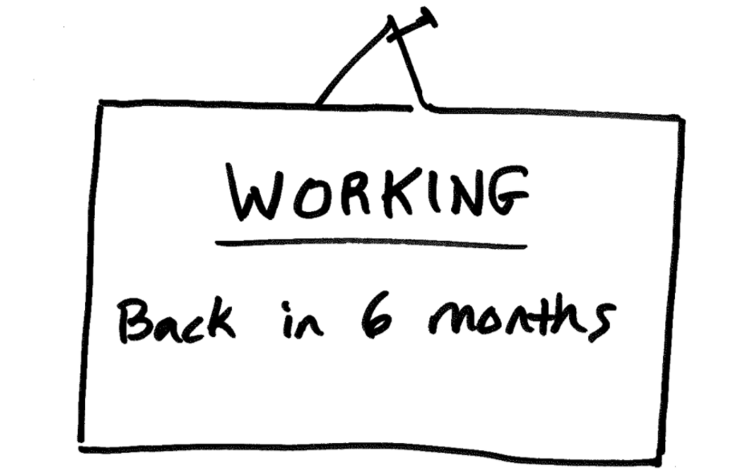

Our team has seen and practiced many flavors of Agile development. Most companies will discuss the agile lingo well, but we all seem to do things a little differently. One extreme example is we once heard our customer talk about conducting 6-month sprints. That seems a bit waterfall-ish to us, but whatever works works. Being different is just fine.

> **We're aiming for a system that assists our team in staying focused on the best possible impact with the least waste.**

These systems help eliminate wasted effort and prevent mistakes for customers and our team.

## We Agile in one-week sprints

We adapted to a smaller iterative flow. These one-week sprints are super tight bites of work. Our projects can range from 3 to 14 months or more. So, each engagement has a high intensity of communication. We work-out-load to reveal our progress, roadblocks, and discuss impact.

## Why one-week sprints?

### 1. High frequency of focus, iteration, and customer face-time

Dialing up the frequency of iterations increases the focus of our efforts. Progress is made quickly. We're releasing changes earlier to get feedback sooner. Come on! We're moving fast.

At first, this can feel rapid, but we make decisions quickly and hold them loosely. Every sprint is an opportunity to reflect with feedback from real customers.

### 2. Easy to schedule, sell, and measure capacity in one-week chunks

A goal of ours has been to solve fewer problems for fewer customers. One step towards this has been to schedule larger chunks of work. So, instead of hours or days, we collect an amount of work that fills a full week.

Stop spending time context-jumping between projects. Project managers, designers, developers, and owners can now juggle 1-2 projects a week. Solving fewer problems for fewer customers is such a mental relief.

## Why two-week sprints?

### 1. better than 6-month sprints 😄

Okay, may I speak freely? If you can't user test with a clickable prototype or release a beta app in a few weeks, your team needs to make the practice of thinking smaller. Get something made and get feedback quickly. Feedback is how we know we're heading in the right direction.

> **Effort without regular feedback is a risk debt you'll have to pay down.**

We've done both for our customers. We've created working beta applications and realistic clickable prototypes in less than a week each. We believe rapid innovation is possible, and we do it. We believe it so much we teach our customers [how to cultivate an innovation mentality in their team](https://sodiumhalogen.com/innovation-workshop?ref=csio).

### 2. better for extensive backlogs where projects last 12+ months

Yes, if the project is a year or more, dial down the intensity a bit. With marathon projects and high-intensity work, there is the risk of the team losing steam. Two wee sprints are perfect for longer projects.

In the book [Clean Agile](https://www.amazon.com/Clean-Agile-Basics-Robert-Martin/dp/0135781868/), Uncle Bob calls the agile sprint pace, Stable Productivity and Sustainable Pace.

> "The race is not to the swift..." – Ecclesiastes 9:11

> "...but he who endures to the end will be saved." – Matthew 24:13

**Our work and faith are with a steady pace and absolute focus. We should do our best to prevent sabotaging any of these.**

## 3 Ways of putting small sprints into action

Turn up the intensity to create something of value quickly. Don't over plan. Take action. Here are some ways to build your innovation muscles.

1. **Plan a one-week sprint** with your team next week. Keep it small and experiment with only staying focused on that work for 80% (~6hrs) of your day.
2. **Try launching in a day**. Move fast and break stuff. Take a crazy idea your team is excited about and use a kanban board to plan and tackle the work. Launch or demo what you have at the end of the day.
3. **The Pomodoro release**. Take a 25min time block to get something out of your head and ready to share with another team member. A sketch, outline, draft, or research is perfect.

The attractive part of [focusing on impactful work](https://chancesmith.io/import-over-effort/) is you'll know when to switch your focus.

- Your innovation advocate, Chance 👋